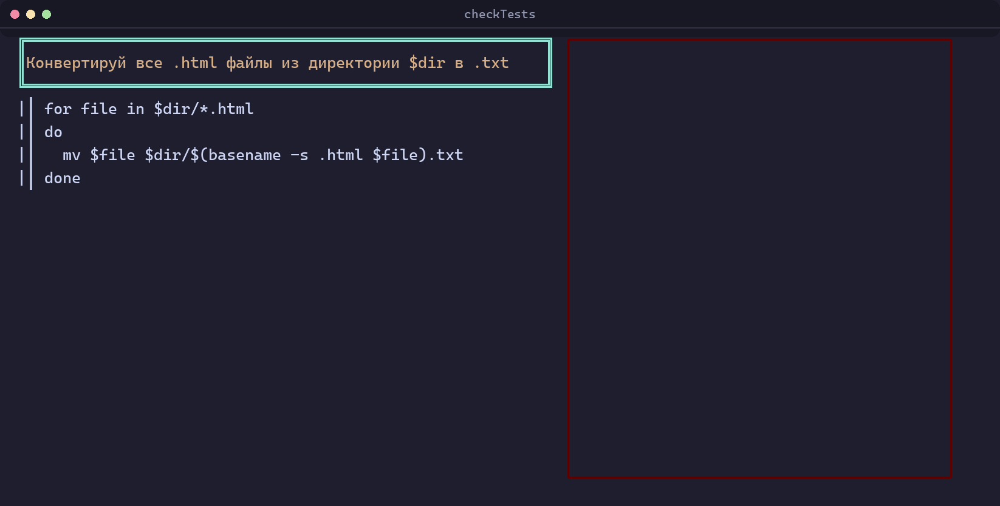
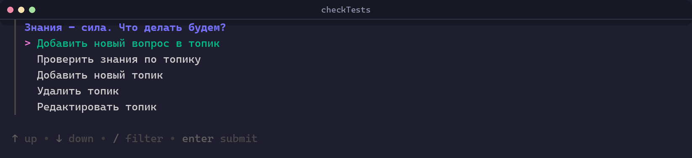
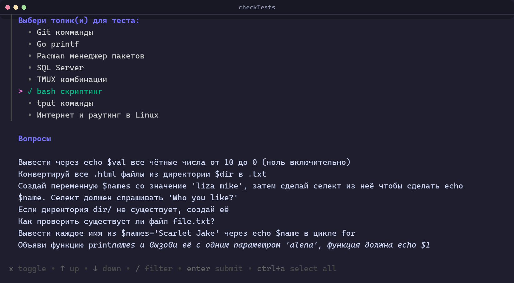
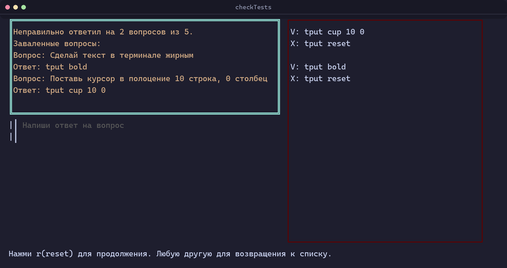
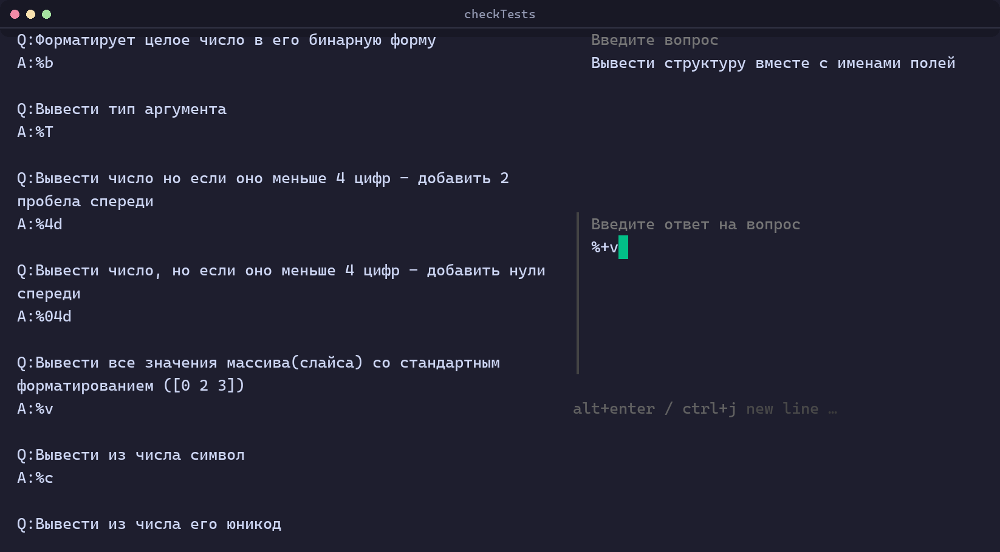
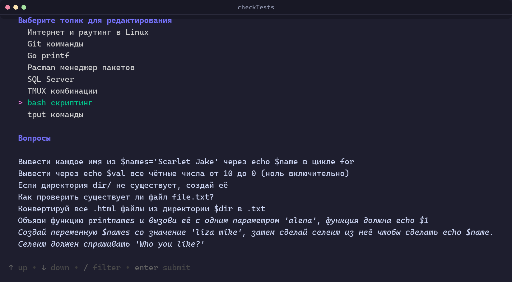

# checkTests

A terminal flashcard app for people who learn by being asked. You keep
question/answer pairs grouped into topics, and the app quizzes you on them —
grading each answer by **edit distance** rather than by exact match, so a typo,
or a code snippet you indented differently, still counts as correct.

Built in Go on [Bubble Tea](https://github.com/charmbracelet/bubbletea),
[huh](https://github.com/charmbracelet/huh) and
[Lipgloss](https://github.com/charmbracelet/lipgloss). It ships with a companion
daemon that keeps the same question set in sync across every machine you use,
over [Tailscale](https://tailscale.com).

> The interface is in Russian — it is what I write my own notes in.



## Highlights

- **Answers are graded, not compared.** A Levenshtein distance between what you
  typed and the stored answer, with a tolerance that grows with the length of
  the answer — see [Grading](#grading).
- **Code snippets are first-class.** Answers can span several lines, and
  leading whitespace is ignored when grading, so a `for` loop you indent with
  two spaces matches one stored with a tab.
- **Shift+enter really works.** A plain terminal sends the same carriage return
  for `enter` and `shift+enter`. The app asks the terminal for xterm's
  `modifyOtherKeys` and rewrites the resulting CSI-u sequence into `alt+enter`
  on its way into Bubble Tea, which has no CSI-u parser of its own
  ([`shiftenter.go`](shiftenter.go)).
- **The filesystem is the database.** One file per topic, one line per pair. No
  schema, no migrations — you can edit a topic in `$EDITOR` and the app picks it
  up.
- **Multi-machine sync.** A separate daemon reconciles topics across any number
  of peers over your tailnet, newest write wins, with atomic file writes and
  per-topic locking ([`cmd/sync/`](cmd/sync)).

## Screens

The main menu — add a question, take a test, or add, remove and edit topics:



Picking what to be tested on. Topics are multi-select, and the panel underneath
lists the questions of whichever topic the cursor is on, so you can see what you
are signing up for:



At the end of a run you get a score and every question you failed, with the
answer you should have given. The panel on the right accumulates the same pairs
live as you go, so a mistake is visible while the next question is on screen:



Adding a question to a topic. The existing pairs stay on the left so you don't
add the same one twice:



Editing drills down: topic → question → answer, with `enter` to go deeper,
`esc` to come back, and `e` to open whatever is highlighted for editing.
Renaming a topic renames its file:



## Grading

`IsInputAndAnswerEqual` scales the tolerance to the length of the expected
answer, so a five-character command has to be exact while a paragraph does not:

| Answer length (runes) | Allowed edit distance |
| --- | --- |
| ≤ 10 | 0 |
| ≤ 15 | 2 |
| ≤ 25 | 4 |
| ≤ 100 | 8 |
| ≤ 250 | 16 |
| ≤ 1000 | 32 |
| longer | < 100 |

Both sides are run through `IgnoreIndentation` first, which trims the
whitespace around every line and drops blank lines altogether — layout is not
what is being tested.

## Storage

Topics live in `~/.local/share/primotibalt/Questions/`, one file per topic. The
file name *is* the topic name. Each line is one pair:

```
Вывести тип аргумента/!/%T
```

`/!/` separates a question from its answer, and `/!n/` stands in for a line
break inside either half, so a multi-line code snippet still occupies exactly
one line on disk.

## Getting started

Requires Go 1.25 or newer.

```sh
git clone git@github.com:primotibalt/TestChecker.git
cd TestChecker
go build -o checkTests .
./checkTests
```

The questions directory is created on first use. Start with *Добавить новый
топик* to make a topic, then *Добавить новый вопрос в топик* to fill it.

Run the tests with:

```sh
go test ./...
go test -race ./cmd/sync/   # the sync daemon's tests are concurrency tests
```

## Syncing across machines

`cmd/sync` is a second `main` package, built and run separately from the TUI. It
keeps `Questions/` identical on every machine on your tailnet:

```sh
go build -o sync ./cmd/sync
TAILSCALE_IP=100.x.y.z TAILSCALE_PARTNER_IP=100.a.b.c,100.d.e.f ./sync
```

- `TAILSCALE_IP` is this machine's listen address; `TAILSCALE_PARTNER_IP` is a
  comma-separated list of every peer. Everyone listens on port `8081`.
- On start it adds `ip rule add to 100.64.0.0/10 lookup 52` if it isn't already
  there, so tailnet traffic uses Tailscale's routing table.
- Then it runs a one-shot **reconcile** against every peer — one goroutine per
  peer, so an unreachable machine never holds up the others. Matching content
  hashes are skipped; otherwise the newer mtime wins and the file is pulled or
  pushed.
- Only after that does the `fsnotify` watcher attach, so files pulled during
  catch-up aren't broadcast straight back.
- Writes are **compare-and-set**: an incoming copy older than the local one is
  refused, so the newest version wins no matter what order the peers arrive in.
  Each write goes to a temp file in the same directory and is `rename`d into
  place, so a reader never sees a half-written topic.
- Each topic name gets its own mutex, so two peers can't collide on one topic
  while unrelated topics keep syncing in parallel.
- Deletions travel live through the watcher but are deliberately *not*
  reconciled: without tombstones, "deleted here" is indistinguishable from
  "added there".

## Layout

| Path | What's in it |
| --- | --- |
| `main.go` | The top-level menu, and the handler each action dispatches to |
| `testknowledge.go`, `testcheck.go` | Picking topics, then the quiz model itself |
| `ld.go` | Levenshtein distance and the indentation-insensitive normaliser |
| `topicquestionappend.go`, `addnewtopic.go`, `removetopic.go`, `edittopic.go` | The four editing flows |
| `shiftenter.go` | The terminal-level shift+enter workaround |
| `topicpersistence/` | Reading and writing topic files — shared by the TUI and the daemon |
| `cmd/sync/` | The sync daemon: config, routing, reconcile, watcher, server, locking |
| `update.sh` | Builds an RPM and publishes it to a local `createrepo_c` repo |
